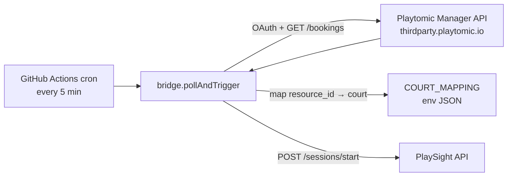

# Playtomic → PlaySight Bridge — Architecture

> **Status: DEPRECATED (2026-04).**
> PlaySight rolled out native Playtomic integration, so this glue is no longer needed.
> **Recommended action:** archive the repo on GitHub (or disable the workflow under `.github/workflows/bridge.yml`).

A short historical record of what this repo did and how it worked, kept for reference.

---

## 1. What it did

When a Playtomic booking was about to start, this service triggered a PlaySight camera recording on the matching court automatically — so players didn't have to scan the on-court QR code to start their own recording.

Scope was a single venue: one Playtomic tenant, one PlaySight facility, padel only.

---

## 2. How it worked



- **Trigger:** `.github/workflows/bridge.yml` ran on a `*/5 * * * *` cron (also `workflow_dispatch` for manual runs). Each run executed `require('./src/bridge').pollAndTrigger()` once and exited.
- **Fetch:** `src/playtomic.js` authenticated against `thirdparty.playtomic.io/api/v1/oauth/token` (client credentials, token cached for ~1h) and pulled `PENDING` padel bookings inside a `[now, now + TRIGGER_AHEAD_MINUTES]` window.
- **Map:** `src/bridge.js` translated each booking's `resource_id` (Playtomic court) into a PlaySight court ID via the `COURT_MAPPING` env JSON. Unmapped courts were skipped with a warning.
- **Trigger recording:** `src/playsight.js` POSTed to `/api/v1/sessions/start` with `{facility_id, court_id, duration_minutes, title}`, where duration came from `booking_end_date - booking_start_date` and title was built from `resource_name` plus participant names.
- **De-dupe:** an in-process `Set` of booking IDs prevented double-triggering. Note: because each GH Actions run was a fresh process, this only protected within a single run, not across runs — the trigger window plus the cron cadence kept duplicates rare in practice.
- **Dry-run mode:** if `PLAYSIGHT_API_KEY` was unset, `startRecording` just logged what it would have done. The PlaySight endpoint shape was inferred (their API is not publicly documented).

There was also an `src/index.js` entry point that ran the same `pollAndTrigger` on a local `node-cron` schedule, for running the bridge as a long-lived process (e.g. via PM2) instead of GitHub Actions.

---

## 3. Why it's deprecated

PlaySight now starts recordings from Playtomic bookings natively, so this middleware has no job to do.

---

## 4. Repo layout

```
playtomic-playsight-bridge/
├── src/
│   ├── index.js       # long-running entry (node-cron); unused once moved to GH Actions
│   ├── bridge.js      # poll Playtomic → map court → trigger PlaySight
│   ├── playtomic.js   # OAuth + GET /bookings against thirdparty.playtomic.io
│   ├── playsight.js   # POST /sessions/start (placeholder shape; dry-run if no key)
│   └── config.js      # env loader + COURT_MAPPING JSON
├── .github/workflows/
│   └── bridge.yml     # cron */5; runs pollAndTrigger() once per invocation
├── .env.example
├── package.json       # deps: dotenv, node-cron
└── README.md
```
